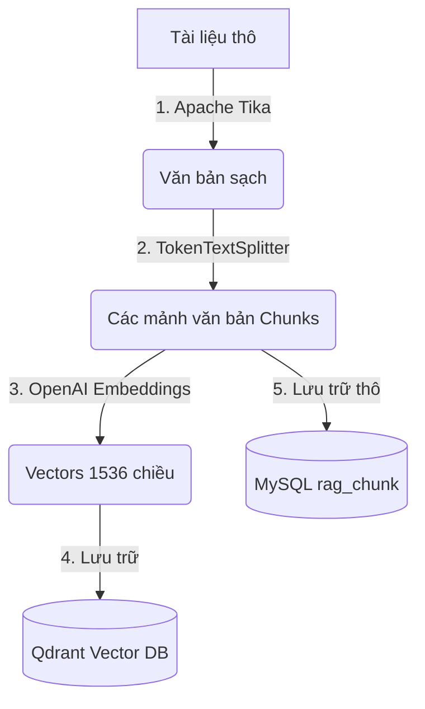

# BÁO CÁO TÍCH HỢP HỆ THỐNG TRÍ TUỆ NHÂN TẠO & RAG (RETRIEVAL-AUGMENTED GENERATION)

**Dự án:** BE-AI-Study-Hub  
**Đối tượng báo cáo:** Ban Giám đốc / Trưởng bộ phận Công nghệ  
**Người thực hiện:** Đội ngũ Kỹ sư AI  
**Mục tiêu:** Xây dựng Module Tra cứu Tài liệu Thông minh tích hợp sâu, tự động ghi chỉ mục khi tải lên và dọn dẹp sạch tài nguyên đồng bộ khi xóa tài liệu.

---

## 1. TỔNG QUAN VỀ CÔNG NGHỆ & KỸ THUẬT RAG ĐÃ SỬ DỤNG

Module RAG (Retrieval-Augmented Generation) được thiết kế theo tiêu chuẩn doanh nghiệp nhằm nâng cao tính chính xác của Mô hình Ngôn ngữ Lớn (LLM), hạn chế hiện tượng "ảo tưởng" (hallucination) bằng cách ràng buộc mô hình chỉ trả lời dựa trên nội dung tài liệu được cung cấp.

### A. Công nghệ cốt lõi (Technology Stack)
* **Ngôn ngữ & Framework:** Java 21, Spring Boot v3.2.6.
* **Thư viện AI:** Spring AI `1.0.0-M1` (milestone ổn định tương thích hoàn toàn với Spring Boot 3.2.x).
* **Mô hình Trích xuất Embedding:** OpenAI `text-embedding-3-small` (1536 chiều, tối ưu hóa độ chính xác ngữ nghĩa và chi phí).
* **Mô hình Ngôn ngữ sinh câu trả lời (LLM):** OpenAI `gpt-4o-mini` (tốc độ cao, chi phí cực thấp, hỗ trợ context window lớn).
* **Cơ sở dữ liệu Vector (Vector Database):** **Qdrant** chạy độc lập trên Docker (giao tiếp qua giao thức gRPC tốc độ cao ở cổng `6334`).
* **Trích xuất văn bản (Text Extraction):** **Apache Tika** (đọc hiểu cấu trúc nhiều định dạng tài liệu PDF, DOCX, TXT).
* **Cắt nhỏ văn bản (Text Splitting):** `TokenTextSplitter` phân chia văn bản dựa trên lượng token để giữ tính toàn vẹn ngữ cảnh.

### B. Các kỹ thuật RAG tiên tiến được áp dụng



1. **Phân mảnh văn bản theo Token (Token-based Chunking):** 
   * Cấu hình **Chunk Size: 800 tokens** và **Overlap: 100 tokens** (lượng token chồng lấn). Việc này giúp đảm bảo các khái niệm ở ranh giới cắt không bị đứt đoạn và giữ được sự liền mạch của ngữ cảnh.
2. **Biểu diễn Vector dày đặc (Dense Vector Embeddings):** 
   * Dùng mô hình OpenAI biến các đoạn text thành vector số thực để đo đạc sự tương đồng về mặt ngữ nghĩa (semantic similarity) thay vì chỉ tìm khớp từ khóa thô.
3. **Tìm kiếm tương đồng ngữ nghĩa bằng KNN (Similarity Search):** 
   * Tìm kiếm top 5 vector tương đồng nhất trong Qdrant bằng khoảng cách Cosine thông qua chỉ mục đồ thị **HNSW (Hierarchical Navigable Small World)** ở tốc độ mili-giây.
4. **Lọc trước theo Siêu dữ liệu (Metadata-enriched Filtering):** 
   * Mỗi vector đẩy lên Qdrant đều mang theo payload bao gồm `documentId`, `originalFileName`, và `uploadedBy`. Hệ thống cho phép lọc trước các vector thuộc quyền sở hữu của chính user yêu cầu trước khi tính toán độ tương đồng, đảm bảo tính bảo mật dữ liệu tuyệt đối giữa các tài khoản.
5. **Nhồi ngữ cảnh vào Prompt (Context Stuffing):** 
   * Tổng hợp 5 mảnh ngữ cảnh liên quan nhất vào mẫu Prompt chuẩn bị trước, định hướng mô hình AI trả lời trong giới hạn thông tin này.
6. **Trích xuất nguồn tham chiếu (Citation / Source Attribution):** 
   * Trích xuất tên file từ metadata của vector tương đồng và trả về cho người dùng để họ đối chiếu tính xác thực của câu trả lời.

---

## 2. LUỒNG DỮ LIỆU HỆ THỐNG (WORKFLOWS)

Để loại bỏ hoàn toàn tài nguyên rác và đảm bảo tính nhất quán dữ liệu, hệ thống tích hợp sâu luồng RAG vào vòng đời của tài liệu chính thông qua cơ chế **Auto-Indexing** và **Sync Cleanup**.

### A. Luồng Tải lên và Tự động lập chỉ mục (Auto-RAG Upload)
* **API Endpoint:** `POST /api/user/document/upload`
1. Người dùng tải tài liệu lên hệ thống thông qua `DocumentController`.
2. Hệ thống tải file vật lý lên **Supabase Storage**, nhận về link URL công khai và đường dẫn bộ nhớ (`storagePath`).
3. Lưu metadata tài liệu gốc vào bảng `document` trong MySQL, cộng dồn kích thước file vào quota dung lượng đã dùng (`storageUsed`) của người dùng trong bảng `user`.
4. Nếu định dạng file là hợp lệ cho RAG (`PDF`, `DOCX`, `TXT`):
   * Tạo một bản ghi trạng thái `PENDING` trong bảng `rag_document` liên kết với `document_id`.
   * Sử dụng **Apache Tika** trích xuất văn bản thô từ file byte.
   * Dùng `TokenTextSplitter` cắt nhỏ văn bản thành các chunks và lưu toàn bộ vào bảng `rag_chunk` trong MySQL (làm bộ nhớ cache thô).
   * Gửi các chunks này sang OpenAI API để lấy vector embeddings, sau đó ghi đè lên **Qdrant Vector DB** kèm metadata chi tiết. Mỗi vector có ID dạng UUID được tạo đồng bộ từ khóa `documentId_chunkIndex`.
   * Cập nhật trạng thái `rag_document` thành `INDEXED` (hoặc `FAILED` nếu có lỗi trong quá trình xử lý).

### B. Luồng Xóa tài liệu đồng bộ (Synchronous Cleanup Delete)
* **API Endpoint:** `DELETE /api/user/document/{documentId}`
1. Kiểm tra quyền sở hữu tài liệu của người dùng hiện tại hoặc vai trò Quản trị viên (`ROLE_AD`). Nếu không có quyền, chặn ngay lập tức.
2. Tìm kiếm thông tin liên kết trong bảng `rag_document` thông qua `documentId`.
3. Nếu tồn tại tài liệu chỉ mục RAG:
   * Lấy danh sách các chunks từ MySQL để tính toán các UUID vector tương ứng.
   * Gửi lệnh xóa đồng thời tất cả các vector tương ứng trên **Qdrant Vector DB** để dọn sạch bộ nhớ RAM của Qdrant.
   * Xóa sạch các bản ghi tương ứng trong bảng `rag_chunk` và `rag_document` trong MySQL.
4. Gửi lệnh xóa file vật lý trên **Supabase Storage** bằng cách tự động giải mã đường dẫn từ URL của file gốc.
5. Trừ bớt kích thước file khỏi giới hạn dung lượng đã sử dụng (`storageUsed`) của người sở hữu để hồi lại hạn mức bộ nhớ.
6. Xóa bản ghi chính trong bảng `document` của MySQL.

---

## 3. CHI TIẾT DANH SÁCH FILE THÊM MỚI & SỬA ĐỔI

Tất cả code được triển khai dựa trên nguyên tắc **SOLID**, kiến trúc phân tầng sạch sẽ (**Clean Architecture**), tiêm phụ thuộc qua Constructor (**Constructor Injection**), và xử lý ngoại lệ tập trung (**Global Exception Handling**).

### A. Các File Được Thêm Mới
1. **[docker-compose.yml](file:///d:/BE-AI-Study-Hub/docker-compose.yml)**
   * *Tác dụng:* Định nghĩa cấu hình container chạy Vector DB Qdrant cục bộ, lưu trữ dữ liệu bền vững (volumes) và kiểm tra sức khỏe dịch vụ (healthcheck) tự động bằng `wget`.
2. **[OpenAiConfig.java](file:///d:/BE-AI-Study-Hub/src/main/java/AiStudyHub/BE/config/OpenAiConfig.java)**
   * *Tác dụng:* Đăng ký Bean `ChatClient` thông qua Builder tự động cấu hình của Spring AI để làm cầu nối tương tác với các mô hình của OpenAI.
3. **[QdrantConfig.java](file:///d:/BE-AI-Study-Hub/src/main/java/AiStudyHub/BE/config/QdrantConfig.java)**
   * *Tác dụng:* Cấu hình kết nối gRPC đến cơ sở dữ liệu Qdrant và đăng ký Bean `VectorStore` của Spring AI.
4. **[RagConfiguration.java](file:///d:/BE-AI-Study-Hub/src/main/java/AiStudyHub/BE/config/RagConfiguration.java)**
   * *Tác dụng:* Cấu hình bộ phân tách từ khóa ngữ nghĩa `TokenTextSplitter` với kích thước 800 tokens và chồng chéo 100 tokens.
5. **[ValidFileType.java](file:///d:/BE-AI-Study-Hub/src/main/java/AiStudyHub/BE/constraint/ValidFileType.java)** & **[FileTypeValidator.java](file:///d:/BE-AI-Study-Hub/src/main/java/AiStudyHub/BE/constraint/validator/FileTypeValidator.java)**
   * *Tác dụng:* Khai báo annotation kiểm tra ràng buộc định dạng file hợp lệ đầu vào của tài liệu RAG (chỉ chấp nhận `PDF`, `DOCX`, `TXT`).
6. **[MaxFileSize.java](file:///d:/BE-AI-Study-Hub/src/main/java/AiStudyHub/BE/constraint/MaxFileSize.java)** & **[MaxFileSizeValidator.java](file:///d:/BE-AI-Study-Hub/src/main/java/AiStudyHub/BE/constraint/validator/MaxFileSizeValidator.java)**
   * *Tác dụng:* Giới hạn kích thước file tải lên tối đa là 20MB để bảo vệ RAM hệ thống.
7. **[RagDocument.java](file:///d:/BE-AI-Study-Hub/src/main/java/AiStudyHub/BE/entity/RagDocument.java)** & **[RagDocumentRepository.java](file:///d:/BE-AI-Study-Hub/src/main/java/AiStudyHub/BE/repository/RagDocumentRepository.java)**
   * *Tác dụng:* Entity JPA và Repository lưu trữ thông tin siêu dữ liệu RAG (tên file, kích thước, người tải, trạng thái index) liên kết với tài liệu gốc qua `documentId`.
8. **[RagChunk.java](file:///d:/BE-AI-Study-Hub/src/main/java/AiStudyHub/BE/entity/RagChunk.java)** & **[RagChunkRepository.java](file:///d:/BE-AI-Study-Hub/src/main/java/AiStudyHub/BE/repository/RagChunkRepository.java)**
   * *Tác dụng:* Entity JPA và Repository lưu trữ nội dung thô của các chunks văn bản. Đóng vai trò là bộ nhớ cache cục bộ để giúp tái lập chỉ mục (re-index) bất cứ khi nào mà không cần tải lại file từ Supabase và không tốn năng lực xử lý CPU để đọc file.
9. **[RagDocumentService.java](file:///d:/BE-AI-Study-Hub/src/main/java/AiStudyHub/BE/service/RagDocumentService.java)** & **[RagDocumentServiceImpl.java](file:///d:/BE-AI-Study-Hub/src/main/java/AiStudyHub/BE/service/impl/RagDocumentServiceImpl.java)**
   * *Tác dụng:* Service interface & implementation xử lý tác vụ ETL (Trích xuất văn bản qua Apache Tika, chia nhỏ văn bản qua textSplitter, đẩy vector vào Qdrant, quản lý trạng thái).
10. **[RagChatService.java](file:///d:/BE-AI-Study-Hub/src/main/java/AiStudyHub/BE/service/RagChatService.java)** & **[RagChatServiceImpl.java](file:///d:/BE-AI-Study-Hub/src/main/java/AiStudyHub/BE/service/impl/RagChatServiceImpl.java)**
    * *Tác dụng:* Triển khai nghiệp vụ Core của chatbot thông minh (tìm kiếm vector tương đồng, dựng prompt context, lấy câu trả lời từ OpenAI và gắn nguồn đính kèm).
11. **[RagChatController.java](file:///d:/BE-AI-Study-Hub/src/main/java/AiStudyHub/BE/controller/RagChatController.java)**
    * *Tác dụng:* REST Controller expose API hỏi đáp tài liệu thông minh `/api/v1/rag/chat/ask` cho giao diện người dùng.
12. **[RagDocumentController.java](file:///d:/BE-AI-Study-Hub/src/main/java/AiStudyHub/BE/controller/RagDocumentController.java)**
    * *Tác dụng:* REST Controller quản lý trạng thái lập chỉ mục RAG (tra cứu trạng thái index, kích hoạt thủ công, xóa metadata).
13. **DTOs:** `ChatRequest`, `ChatResponse`, `UploadDocumentResponse`, `RagChunkResponse`, `PaginatedResponse`.
14. **Mappers:** `RagDocumentMapper`, `RagChunkMapper`.
15. **Exceptions:** `ResourceNotFoundException`, `InvalidFileException`, `RagProcessingException`, `VectorStoreException`.

### B. Các File Được Sửa Đổi
1. **[pom.xml](file:///d:/BE-AI-Study-Hub/pom.xml)**
   * *Hành động:* Tích hợp Spring AI BOM, bổ sung các starter OpenAI, Qdrant, thư viện đọc Apache Tika (`spring-ai-tika-document-reader`), thư viện gRPC API và khai báo repository lưu trữ milestone của Spring.
2. **[application.yaml](file:///d:/BE-AI-Study-Hub/src/main/resources/application.yaml)**
   * *Hành động:* Kích hoạt cấu hình cho phép đè cấu hình bean của bên thứ ba (`allow-bean-definition-overriding: true`), bổ sung các tham số cấu hình cho OpenAI (model chat `gpt-4o-mini`, model nhúng `text-embedding-3-small`) và Vectorstore Qdrant.
3. **[.env](file:///d:/BE-AI-Study-Hub/.env)**
   * *Hành động:* Thêm cấu hình biến môi trường `SPRING_AI_OPENAI_API_KEY` để lưu trữ khóa bảo mật bên ngoài file cấu hình tĩnh.
4. **[IDocument.java](file:///d:/BE-AI-Study-Hub/src/main/java/AiStudyHub/BE/service/impl/IDocument.java)** & **[DocumentService.java](file:///d:/BE-AI-Study-Hub/src/main/java/AiStudyHub/BE/service/DocumentService.java)**
   * *Hành động:* Cập nhật hàm `uploadDocument` để kích hoạt RAG auto-indexing khi tải lên thành công các định dạng file hỗ trợ. Khai báo và viết toàn bộ logic xử lý dọn dẹp tài nguyên đồng bộ (`deleteDocument`) giải phóng bộ nhớ lưu trữ vật lý, vector DB và database quan hệ cùng quota dung lượng của user.
5. **[DocumentController.java](file:///d:/BE-AI-Study-Hub/src/main/java/AiStudyHub/BE/controller/DocumentController.java)**
   * *Hành động:* Bổ sung endpoint `DELETE /api/user/document/{documentId}` nhận thông tin user đăng nhập qua `@AuthenticationPrincipal` để phục vụ chức năng xóa tài liệu an toàn.
6. **[GlobalExceptionHandler.java](file:///d:/BE-AI-Study-Hub/src/main/java/AiStudyHub/BE/exception/GlobalExceptionHandler.java)**
   * *Hành động:* Cập nhật định dạng bắt lỗi thống nhất để trả về JSON dạng chuẩn `APIResponse` cho các lỗi kiểm thực dữ liệu.

---

## 4. HƯỚNG DẪN KIỂM THỬ HỆ THỐNG (API TESTING GUIDE)

### Bước 1: Đăng nhập hệ thống lấy mã JWT Token
Mọi endpoint trong hệ thống đều được bảo mật. Bạn cần thực hiện đăng nhập qua endpoint đăng nhập chính của bạn để lấy mã Token:
* **API:** `POST /api/auth/login` (hoặc qua cơ chế Google OAuth2).
* **Kết quả:** Lấy mã token trong phản hồi (ví dụ: `eyJhbGciOiJIUzUxMi...`).

---

### Bước 2: Tải lên tài liệu chính thức (Tự động kích hoạt RAG)
Tải lên một tài liệu hợp lệ trong định dạng PDF, DOCX, hoặc TXT thông qua Postman.
* **Method:** `POST`
* **URL:** `http://localhost:8080/api/user/document/upload`
* **Headers:**
  * Thêm key: `Authorization` | Value: `Bearer <MÃ_TOKEN_BƯỚC_1>`
* **Body:** Chọn kiểu **`form-data`**
  * Thêm key: `file` | Chuyển kiểu dữ liệu sang **`File`** | Nhấp chọn một file tài liệu từ máy tính (ví dụ: file văn bản `tailieu_huongdan.txt` chứa một số thông tin đặc thù).
  * Thêm key: `title` | Value: `Tài liệu Hướng dẫn Sử dụng RAG`
  * Thêm key: `subjectId` | Value: `1` (Chọn ID của một môn học hợp lệ trên DB của bạn).
* **Kết quả thành công:** Trả về trạng thái `200` kèm thông tin metadata của file và lưu trữ lên Supabase thành công. Phía console log hệ thống sẽ xuất hiện log tự động trích xuất text, chia nhỏ và nạp vectors thành công vào Qdrant.

---

### Bước 3: Hỏi đáp RAG thông minh
Thực hiện truy vấn câu hỏi liên quan đến nội dung tài liệu vừa tải lên.
* **Method:** `POST`
* **URL:** `http://localhost:8080/api/v1/rag/chat/ask`
* **Headers:**
  * Key: `Authorization` | Value: `Bearer <MÃ_TOKEN_BƯỚC_1>`
  * Key: `Content-Type` | Value: `application/json`
* **Body:** Chọn kiểu **`raw`** và chọn định dạng **`JSON`**
  * Nhập nội dung câu hỏi:
    ```json
    {
      "question": "Nội dung câu hỏi của bạn xoay quanh tài liệu vừa tải lên?"
    }
    ```
* **Kết quả thành công:** Trả về câu trả lời tự nhiên dạng chuỗi `"answer"` được sinh ra từ LLM dựa trên ngữ cảnh đã cung cấp, kèm danh sách `"sources"` là tên file nguồn của tài liệu gốc được trích xuất từ metadata.

---

### Bước 4: Xóa tài liệu đồng bộ giải phóng tài nguyên
* **Method:** `DELETE`
* **URL:** `http://localhost:8080/api/user/document/{documentId}`
* **Headers:**
  * Key: `Authorization` | Value: `Bearer <MÃ_TOKEN_BƯỚC_1>`
* **Kết quả thành công:** Trả về trạng thái `200` với thông báo xóa tài liệu thành công. Mọi vectors lưu trong Qdrant liên quan tới tài liệu này, các chunks lưu ở MySQL, file trên Supabase và quota của user đều được dọn dẹp sạch sẽ.

---

## 5. QUẢN LÝ DỊCH VỤ DOCKER QDRANT

Giao diện quản trị đồ họa Dashboard của Qdrant có sẵn tại địa chỉ: **[http://localhost:6333/dashboard](http://localhost:6333/dashboard)**.

### Các lệnh quản lý nhanh dịch vụ qua Docker Compose:

* **Khởi chạy container Qdrant dưới dạng chạy ngầm (background):**
  ```bash
  docker compose up -d
  ```
* **Kiểm tra trạng thái hoạt động và sức khỏe của container:**
  ```bash
  docker compose ps
  ```
  *(Khi khởi động hoàn tất, cột Status của qdrant-db phải hiển thị trạng thái `healthy`).*
* **Xem log thời gian thực của cơ sở dữ liệu Vector:**
  ```bash
  docker compose logs -f qdrant
  ```
* **Dừng hoạt động của container Qdrant:**
  ```bash
  docker compose down
  ```
